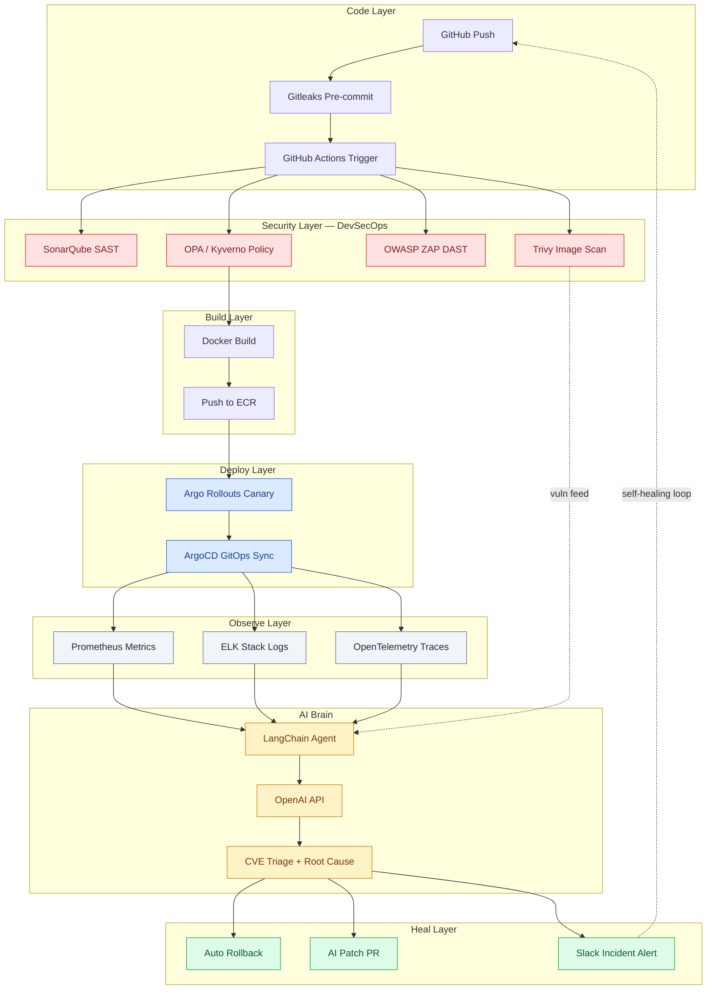

## AI-Powered Self-Healing CI/CD Pipeline with DevSecOps

> Autonomous DevSecOps system that detects failures, diagnoses root causes, and heals production systems in under 90 seconds.


---

## Project tagline

> **Detects:** real-time deployment failures, CVEs, and runtime anomalies across logs, metrics, and traces
> **Fixes:** production issues automatically via rollback, AI-driven patching, and policy enforcement
> **Replaces:** manual debugging, delayed security reports, and reactive on-call firefighting

---

## Architecture diagram



---

## Screenshots

### Session 1 — Flask app running locally

*Flask app on localhost:5000 — all 3 routes returning healthy responses*

### Session 2 — GitHub Actions CI pipeline

*Coming in Session 2 — CI pipeline with test, build, and scan stages*

### Session 10 — AI agent root cause diagnosis

*Coming in Session 10 — LangChain agent JSON output with root cause and fix*

### Session 12 — Self-healing event timeline

*Coming in Session 12 — Slack message showing 90-second auto-recovery*

### Session 13 — Grafana unified dashboard

*Coming in Session 13 — security events, deployment status, AI decisions*

> **Adding your Session 1 screenshot:**
> 1. Run `docker compose up --build`
> 2. Open browser to `http://localhost:5000/health`
> 3. Screenshot your terminal (left) alongside the browser (right)
> 4. Save as `docs/screenshots/app-running.png`
> 5. Commit: `git add docs/screenshots/ && git commit -m "docs: add session 1 app screenshot"`

---

## The problem this solves

At 2 AM, a deployment goes wrong. An engineer receives a PagerDuty alert, fumbles awake, opens their laptop, and begins the slow and exhausting process of reading logs, correlating metrics, and guessing at a root cause. By the time they identify the bad image, execute a rollback, and verify recovery, 23 minutes have passed. That is 23 minutes of downtime, cognitive cost, and sleep deprivation — for a problem that had a known fix the moment it appeared.

Most engineering teams also have a security gap that nobody likes to talk about. Vulnerability reports from Snyk or Trivy arrive weekly, get triaged into tickets, and sit unresolved for weeks. CVEs with known patches go unfixed not because engineers are careless, but because there is no system connecting the finding to the fix automatically. Meanwhile, hardcoded secrets slip through code review, SQL injection patterns survive static analysis because nobody configured the gates properly, and containers run as root in production because nobody wrote the admission policy.

This project exists to close both gaps simultaneously. When a deployment fails, the system detects it within 45 seconds, calls an AI agent with the full log and metrics context, receives a structured root cause diagnosis, and triggers an Argo Rollouts rollback before a human has even read the first alert. When a CVE is found in the Docker image, the AI agent triages it by exploitability rather than raw CVSS score, checks if a patch exists, and raises a GitHub pull request with the fix — all before the build pipeline finishes.

The measurable outcome is an MTTR of 90 seconds instead of 23 minutes, zero CVEs older than 24 hours in any deployed image, and no secret ever reaching the remote repository. These are not aspirational goals. They are the direct result of shifting every reactive human decision into an automated, AI-assisted pipeline that runs whether engineers are awake or not.

---

## Project structure

```
ai-devsecops-platform/
├── app/                              # Flask application source
│   ├── main.py                       # Routes: /, /health, /api
│   ├── requirements.txt              # Python dependencies
│   └── tests/                        # Unit and integration tests
│       └── test_routes.py
├── k8s/                              # Kubernetes manifests
│   ├── deployment.yaml               # Argo Rollouts canary config
│   ├── service.yaml                  # ClusterIP + LoadBalancer
│   └── hpa.yaml                      # Horizontal Pod Autoscaler
├── .github/
│   └── workflows/
│       ├── ci.yml                    # Build, test, SAST, image scan
│       └── cd.yml                    # Deploy, monitor, self-heal
├── terraform/                        # AWS infrastructure as code
│   ├── main.tf                       # EKS, ECR, VPC, IAM roles
│   └── variables.tf                  # Configurable inputs
├── security/                         # Security tool configuration
│   ├── sonar-project.properties      # SonarQube quality gate config
│   ├── trivy-config.yaml             # CVE severity thresholds
│   └── opa-policies/                 # Kubernetes admission policies
│       ├── no-root-containers.yaml
│       └── require-resource-limits.yaml
├── monitoring/                       # Observability stack
│   ├── prometheus-rules.yaml         # Alerting rules
│   ├── grafana-dashboard.json        # Exported dashboard config
│   └── ai-agent/                     # LangChain agent source
│       ├── agent.py                  # Root cause analysis engine
│       └── cve-triage.py             # Vulnerability auto-patch logic
├── docs/
│   └── screenshots/                  # Session progress screenshots
├── Dockerfile                        # Multi-stage production build
├── docker-compose.yml                # Local development stack
├── .pre-commit-config.yaml           # Gitleaks + lint hooks
└── README.md
```

---

## Quick start

### Prerequisites

Verify these are installed before starting:

```bash
python --version       # Should show 3.11.x or higher
docker --version       # Should show 24.x or higher
git --version          # Should show 2.40.x or higher
```

Install pre-commit:

```bash
pip install pre-commit
pre-commit --version
```

**You should see:** `pre-commit 3.x.x`

### Run Session 1 locally

**Step 1 — Clone the repo**

```bash
git clone https://github.com/Ashish420-tech/ai-devsecops-platform.git
cd ai-devsecops-platform
```

**You should see:** the repo folder contents when you run `ls`

**Step 2 — Install pre-commit hooks**

```bash
pre-commit install
```

**You should see:** `pre-commit installed at .git/hooks/pre-commit`

**Step 3 — Build and start the app**

```bash
docker compose up --build
```

**You should see:** `Running on http://0.0.0.0:5000` in the terminal output

**Step 4 — Test all 3 routes**

Open a second terminal and run:

```bash
curl http://localhost:5000/
curl http://localhost:5000/health
curl http://localhost:5000/api
```

**You should see:**
- `/` → `{"message": "Welcome to AI DevSecOps Platform"}`
- `/health` → `{"status": "healthy"}`
- `/api` → `{"data": "API endpoint working"}`

**Step 5 — Verify Gitleaks is active**

```bash
echo 'AWS_SECRET_KEY = "Your_secret_key"' >> test_secret.txt
git add test_secret.txt
git commit -m "test: checking gitleaks"
```

**You should see:** Gitleaks blocks the commit with a red `FAILED` output showing the detected secret. Then clean up:

```bash
rm test_secret.txt
git reset HEAD test_secret.txt 2>/dev/null || true
```

---

## Sessions roadmap

| # | Session | Key Tools | Status |
|---|---------|-----------|--------|
| 1 | Project scaffold + local app | Flask, Docker, Gitleaks | ✅ Complete |
| 2 | GitHub Actions CI pipeline | GitHub Actions, pytest, Docker cache | ⏳ Upcoming |
| 3 | SAST security scanning | SonarQube, sonar-scanner | ⏳ Upcoming |
| 4 | Docker image CVE scanning | Trivy, GitHub Artifacts | ⏳ Upcoming |
| 5 | Kubernetes + canary deploy | Minikube, Argo Rollouts, kubectl | ⏳ Upcoming |
| 6 | GitOps + policy enforcement | ArgoCD, Kyverno, OPA | ⏳ Upcoming |
| 7 | Metrics + alerting | Prometheus, Alertmanager, Helm | ⏳ Upcoming |
| 8 | Centralized logging + SIEM | ELK Stack, Filebeat, Kibana | ⏳ Upcoming |
| 9 | DAST scanning | OWASP ZAP, staging environment | ⏳ Upcoming |
| 10 | AI root cause agent | LangChain, OpenAI API, webhooks | ⏳ Upcoming |
| 11 | AI CVE triage + auto-PR | LangChain, GitHub API, Snyk | ⏳ Upcoming |
| 12 | Self-healing loop | Argo Rollouts rollback, MTTR | ⏳ Upcoming |
| 13 | Grafana unified dashboard | Grafana, Loki, dashboard JSON | ⏳ Upcoming |
| 14 | AWS cloud deployment | Terraform, EKS, ECR, t3.micro | ⏳ Upcoming |
| 15 | Portfolio + demo video | README, LinkedIn post, video script | ⏳ Upcoming |

> Each session builds on the previous one. Do not skip sessions.
> Full build time: 4–6 weeks at 1 session per 2–3 days.

---

## Tech stack

| Layer | Tool | Purpose | Version | Status |
|-------|------|---------|---------|--------|
| App | Python Flask | REST API | 2.3 | ✅ Complete |
| Secret scan | Gitleaks | Pre-commit secret detection | 8.x | ✅ Complete |
| Container | Docker | Image build | 24.x | ✅ Complete |
| Local dev | Docker Compose | Local stack | v2 | ✅ Complete |
| CI/CD | GitHub Actions | Pipeline automation | latest | ⏳ Upcoming |
| SAST | SonarQube | Static code analysis | Community | ⏳ Upcoming |
| Image scan | Trivy | CVE detection | latest | ⏳ Upcoming |
| DAST | OWASP ZAP | Runtime vulnerability scan | latest | ⏳ Upcoming |
| Policy | OPA / Kyverno | Kubernetes admission control | latest | ⏳ Upcoming |
| Orchestration | Kubernetes | Container orchestration | 1.28+ | ⏳ Upcoming |
| Canary | Argo Rollouts | Progressive delivery | latest | ⏳ Upcoming |
| GitOps | ArgoCD | Drift detection + sync | latest | ⏳ Upcoming |
| Metrics | Prometheus | Time-series monitoring | latest | ⏳ Upcoming |
| Alerting | Alertmanager | Alert routing + webhooks | latest | ⏳ Upcoming |
| Logs | ELK Stack | Centralized logging + SIEM | 8.x | ⏳ Upcoming |
| Traces | OpenTelemetry | Distributed tracing | latest | ⏳ Upcoming |
| AI agent | LangChain | Orchestration + tool use | 0.2.x | ⏳ Upcoming |
| LLM | OpenAI API | Root cause + CVE triage | gpt-4o-mini | ⏳ Upcoming |
| ChatOps | Slack API | Incident notifications | latest | ⏳ Upcoming |
| IaC | Terraform | AWS infrastructure | 1.7+ | ⏳ Upcoming |
| Cloud | AWS EKS + ECR | Production cluster | free tier | ⏳ Upcoming |
| Dashboard | Grafana | Unified ops + security view | latest | ⏳ Upcoming |

---

## DevSecOps security layer

Gitleaks runs at two points in this pipeline — as a pre-commit hook on the developer's machine and again as a step inside GitHub Actions. This dual-layer approach means a secret never reaches the remote repository under any circumstance. It catches AWS access keys, GitHub personal access tokens, private RSA keys, JWT secrets, database connection strings, and any pattern matching known credential formats across 150+ providers. The reason this matters is that a secret committed to a public GitHub repository is compromised within seconds — automated scanners harvest them continuously. Prevention at the commit level is the only reliable defense.

SonarQube performs static application security testing by reading the source code without executing it. Where Gitleaks looks for secrets, SonarQube looks for vulnerable patterns: SQL injection risks, hardcoded passwords in logic (not just strings), insecure cryptographic functions, null pointer dereferences, and code that violates OWASP Top 10 rules. It assigns a quality gate that the pipeline must pass before the Docker image is built. If the gate fails, the build stops. This makes insecure code as undeployable as broken code.

Trivy scans the Docker image after it is built, comparing every layer and every installed package against the National Vulnerability Database. It is doing something different from SonarQube — SonarQube reads your code, Trivy reads your dependencies and base image. A vulnerable version of OpenSSL buried inside your Python base image is invisible to SonarQube but immediately visible to Trivy. This pipeline is configured to fail on CRITICAL severity findings only, because failing on LOW and MEDIUM creates alert fatigue and teaches engineers to ignore the scanner.

OWASP ZAP performs dynamic application security testing by actually running the deployed application in a staging environment and attacking it the way a real attacker would. It probes for cross-site scripting, SQL injection through the API surface, authentication bypasses, insecure headers, and CSRF vulnerabilities — vulnerabilities that only appear when the application is running and handling real HTTP requests. SAST cannot find these because they are runtime behaviors. ZAP cannot find them until the app is deployed. Together, SAST and DAST cover the full vulnerability surface.

OPA and Kyverno enforce security policy at the Kubernetes admission layer, which is the last checkpoint before a workload reaches production. This pipeline implements two non-negotiable policies: no container may run as the root user, and every container must declare CPU and memory resource limits. These are not recommendations — a manifest that violates either policy is rejected by the cluster before it is scheduled. This prevents an entire class of container escape attacks and runaway resource consumption that has caused production incidents at every major cloud company.

---

## AI agent capabilities

### What the agent ingests

- Last 50 log lines from Elasticsearch, filtered to ERROR and WARN levels, timestamped
- Current alert state from the Prometheus API including labels, annotations, and firing duration
- Trivy CVE report JSON from the most recent image scan
- Argo Rollouts deployment status including canary weight, error rate, and replica health

### What the agent outputs

- Root cause classification with a specific, actionable description
- Severity score from 1 to 5 based on user impact, not just technical severity
- Fix recommendation in plain English with the exact command or change needed
- Auto-generated GitHub pull request when a CVE has a patched dependency version available
- Slack message with the full incident timeline, diagnosis, and recovery confirmation

### Realistic example

**Input sent to AI agent**

```json
{
  "last_logs": [
    "2024-01-15T02:47:13Z ERROR app.api - Connection timeout after 30s: upstream db-service:5432",
    "2024-01-15T02:47:14Z ERROR app.api - HTTPException: 503 Service Unavailable",
    "2024-01-15T02:47:14Z WARN  app.health - Health check failed: db unreachable"
  ],
  "alert": {
    "labels": {
      "alertname": "HighErrorRate",
      "deployment": "flask-app",
      "severity": "critical"
    },
    "annotations": {
      "summary": "Error rate 23% on canary pods for 45s"
    },
    "state": "firing",
    "firing_since": "45s"
  },
  "deployment": {
    "name": "flask-app",
    "canary_weight": 20,
    "stable_replicas": 4,
    "canary_replicas": 1,
    "canary_error_rate": "23%"
  }
}
```

**Output from AI agent**

```json
{
  "root_cause": "Database connectivity failure on canary pods — new image likely introduced a misconfigured DB_HOST environment variable or missing secret mount",
  "severity": 4,
  "confidence": "91%",
  "fix": "Roll back canary to stable image. Verify DB_HOST secret is mounted in the new deployment manifest before re-deploying.",
  "auto_action": "Argo Rollouts rollback triggered at T+68s — canary traffic redirected to stable image",
  "slack_summary": "Deployment flask-app auto-rolled back at 02:47:23 UTC. Root cause: DB connection failure on canary pods (23% error rate, 45s). Stable image restored. MTTR: 90s. No action required.",
  "mttr_estimate": 90
}
```

---

## What happens when a deployment fails

Every step below is fully automated. No human intervention required.

1. **T+0s** — Bad image pushed to main branch, canary deployment starts at 20% traffic
2. **T+30s** — Error rate climbs to 23% on canary pods, stable pods unaffected
3. **T+45s** — Prometheus error rate threshold breached, alert enters FIRING state
4. **T+60s** — Alertmanager fires webhook to AI agent Python service
5. **T+63s** — AI agent fetches last 50 log lines from Elasticsearch
6. **T+65s** — AI agent calls OpenAI API with log + metrics context, receives diagnosis
7. **T+68s** — Argo Rollouts rollback command issued via kubectl
8. **T+75s** — 100% traffic redirected to previous stable image
9. **T+80s** — Error rate returns to 0%, health checks pass
10. **T+90s** — Slack message posted with full timeline, root cause, and MTTR

> **Without this system:** An engineer receives a PagerDuty alert at 2:47 AM. They spend
> 8 minutes reading logs, 4 minutes identifying the bad image, 6 minutes executing the
> rollback, 5 minutes verifying recovery. Total time: ~23 minutes. With sleep disruption,
> cognitive cost, and degraded next-day performance included.
>
> **With this system:** MTTR = 90 seconds. The engineer wakes up to a Slack message
> that says the incident is already resolved.

---

## Contributing

1. Fork the repository
2. Create a feature branch: `git checkout -b feat/your-feature-name`
3. Make your changes
4. Ensure all pre-commit hooks pass: `pre-commit run --all-files`
5. Write or update tests if your change affects application logic
6. Open a pull request describing: what you changed, why, and how to test it

Pre-commit hooks will block commits containing secrets, failing lint, or improperly formatted code. This is intentional — the same gates that protect the main branch apply to all contributions.

---

## License

MIT License

---

Built with obsession by **Ashish Mondal**

[GitHub](https://github.com/Ashish420-tech) · [Star this repo](https://github.com/Ashish420-tech/ai-devsecops-platform/stargazers)

> *"The best on-call engineer is the one the system never needs to wake up."*
